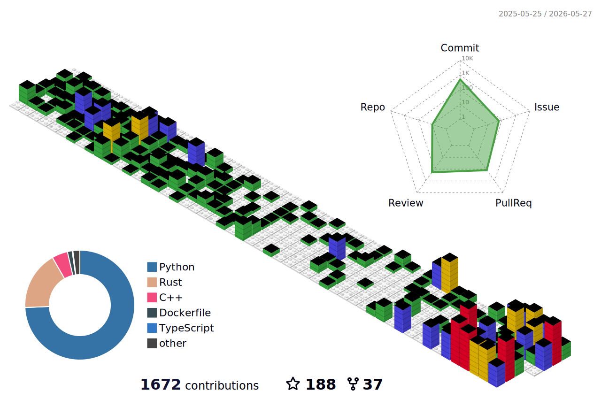

### 
I'm Andrew, an Infrastructure Engineer focused on AI.

 I'm an AI Infrastructure Engineer at NVIDIA, where I build platforms and infrastructure that help developers run AI workloads at scale. My background is in cloud infrastructure, distributed systems, and platform engineering, with a focus on building reliable systems that developers enjoy using. 

 
More...

 

 Outside of work, I write open-source software, primarily in Rust and Python. Most of my projects revolve around infrastructure, developer tooling, distributed systems, self-hosting, and the occasional hardware experiment. 

 I'm also an amateur radio operator and occasionally write software for the amateur radio community, particularly around APRS. 

<ul> <li>I'm currently focused on local AI inference, agentic coding workflows, and infrastructure for running large language models.</li> <li>I spend most of my free time writing Rust, although I still reach for Python and TypeScript when they're the right tool for the job.</li> <li>I enjoy building infrastructure that is simple to operate, easy to automate, and pleasant for developers to work with.</li> <li>If you'd like to chat, ask me about Rust, Kubernetes, AI infrastructure, distributed systems, or homelab projects.</li> </ul>

   

## Connect with me  

  
  
   

## Github Stats  

<table>
  <tr>
    <td valign="top" width="33%">
      

        
      

    </td>
    <td valign="top" width="33%">
      

        
      

    </td>
    <td valign="top" width="33%">
      

        
      

    </td>
  </tr>
</table>

