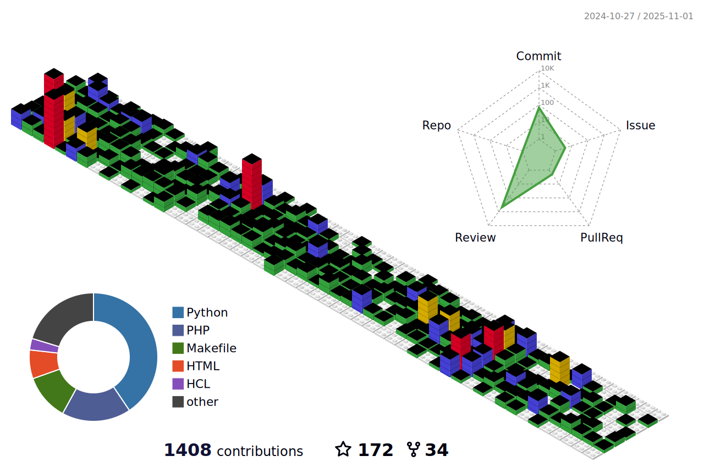

### 
I'm Andrew, an Infrastructure Engineer who pretends to be a Software Engineer
  
  

I work for Autodesk Construction Cloud building platforms and automation to deliver secure, managed infrastructure to our developers.

  
More...

   
    <ul>
        <li>🔭 I’m currently working on <a href="https://github.com/andrewthetechie/pydantic-aioredis" target=_blank>pydantic-aioredis</a> and a <a href="https://github.com/andrewthetechie/cq-provider-datadog" target=_blank>Datadog Provider for Cloudquery</a>.</li>
        <li>🌱 I’m currently learning more about <a href="https://www.cloudquery.io/" target=_blank>Cloudquery</a> and <a href="https://aws.amazon.com/serverless/sam/" target=_blank>AWS Serverless</a>.</li>
        <li>❓ Ask me about anything related to scaling and automating your cloud infrastructure.  </li>
    </ul>

   

## Connect with me  

  

  
  

   

## Github Stats  
<table><tr><td valign="top" width="50%">

</td><td valign="top" width="50%">

</td>
</tr></table>  

  

 

